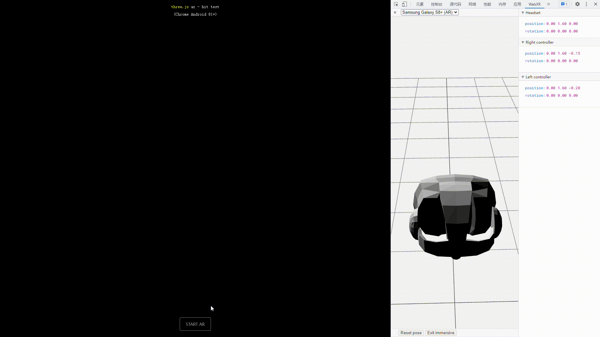
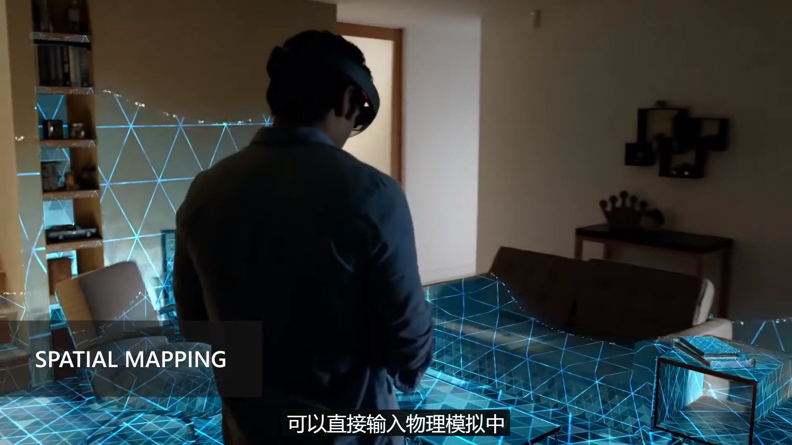

# TODO

- 直接看 three.js 的源码来学习 WebXR API （ WebXRManager.js ）。
- 搞清楚参考空间
- 重构 onSessionStart、onSessionEnd
- 弄清楚 session 的所有事件类型
- Babylon.js 官网中有 WebXR API 的示例代码，可惜是基于 Babylon.js 的：https://doc.babylonjs.com/divingDeeper/webXR/introToWebXR


# WebXR emulator

WebXR emulator 是由 mozilla 开发的浏览器插件，用于在浏览器中模拟 AR/VR 设备，安装与介绍请见 [官方 Blog](https://blog.mozvr.com/webxr-emulator-extension/)。

## 如何模拟 VR

1. 在控制台中选择 WebXR 扩展；
2. 选择正确的 VR 设备；
3. 打开 VR 页面（请确保在开启 VR 页面之前，已经选择了正确的 VR 设备）；
4. 使用；


## 如何模拟 AR

1. 在控制台中选择 WebXR 扩展；
2. 选择正确的 AR 设备（目前只有 Samsung Galaxy S8+(AR) 可用）；
3. 打开 AR 页面（请确保在开启 AR 页面之前，已经选择了正确的 AR 设备）；
4. 使用；

用 WebXR emulator 来模拟使用 AR 并不怎么好用。




# Features

> 主要参考资料：
>
> - [API 的义与用例（2021.08.03）](https://www.youtube.com/watch?v=t-uk8InHte4&list=PLW2iP2Rz9wsKTPwDEW1KhxcWkuwur_E9t)
> - [API 实现规划](https://www.w3.org/2020/05/immersive-Web-wg-charter.html)
> - [API 支持度](https://immersiveweb.dev/)
>
> 次要参考资料：
>
> - [Ada Rose Cannon 介绍了 WebXR 在未来将会新增那些特性（2020.09.04）](https://www.youtube.com/watch?v=ypSkIYpJjE8)
> - [视频展示每种 API （2020.10.21）](https://www.youtube.com/watch?v=dssQSeTrqPI)
> - [WebXR Github](https://github.com/immersive-web)

## WebXR Core

WebXR Core 是第一个 WebXR 模块，它被设计成其它模块的底层。

通过挂载在 `window.navigator` 上的 `xr` 对象来使用 WebXR Core ：

```js
if ("xr" in window.navigator) {    
	/* WebXR can be used. */

    const supported = await window.navigator.xr.isSessionSupported("immersive-vr");
    const xr_session = await window.navigator.xr.requestSession("immersive-vr");
    
} else {
    /* WebXR isn't available. */
}
```

> WebXR Core 自身仅支持虚拟现实（ VR ），增强现实由后来退出的增强现实模块支持。

## AR Module

增强现实模块非常简单，它能让 WebXR 场景渲染虚拟的内容，比如使用 WebXR 在智能手机或透明显示器上显示虚拟的内容。它没有任何增强现实的高级特性，高级特性们都来自额外的 WebXR 模块。

增强现实的使用方法和虚拟现实的使用方法非常相似：

```js
if ("xr" in window.navigator) {
	/* WebXR can be used. */
    
    const supported = await window.navigator.xr.isSessionSupported("immersive-ar");
    const xr_session = await window.navigator.xr.requestSession("immersive-ar");
    
} else {
    /* WebXR isn't available. */
}
```

## DOM Overlays

由于 WebXR 是基于 WebGL 的，没有对 HTML 和 CSS 的内置支持，这意味着如果你想要构建用户界面或添加超链接标签，都只能通过 WebGL 来构建，事情就会变得非常棘手，比如将需要渲染的内容输出为图像，然后将图像作为纹理贴在虚拟物体的表面。

DOM Overlays 允许你在场景中使用部分的 HTML 和 CSS ，注意该特性目前只适用于手持设备的增强现实（ Ada Rose Cannon ：因为只有在该场景下才有意义）。

它的工作原理是：激活 session 之前，你需要调用 DOM Overlays 特性，并传递一个元素节点进来，之后增强现实程序将会拥有 3 个视图层。顶层是 HTML/CSS 视图层，它由用户代理渲染，且该元素节点会被全屏展示；中间层是 WebGL 视图层（由 WebGL 渲染并发送至 WebXR ），底层是摄像机视图层。

除了能够更轻松的绘制用户界面外，它的另一个好处是：相比于在 WebGL 中渲染用户界面， HTML/CSS 的渲染速度更快、延迟更低，因为将内容制成位图再输出为纹理时更慢，且有时还要考虑光照的影响。

```js
window.navigator.xr.requestSession("immersive-ar", {
    optionalFeatures: ["dom-overlay"],
    domOverlay: {
        root: document.getElementById("overlay")
    }
});
```

> `optionalFeatures` 是指该特性是可选的，当运行时不支持该特性时，程序也不会被杀死，而是忽略使用该特性。

## Gamepads

它是针对虚拟现实和增强现实的特性，用于支持游戏手柄。你可以通过 WebXR 的输入源来访问相应的游戏手柄对象， WebXR 输入源可以是各种各样的用于访问场景的控制器设备，比如单手持握的遥控器，上面有摇杆，还有各种按钮，还可以检测物体的位置和旋转，所有按钮和摇杆都会被当作 gamepad 对象，你可以获取按钮的压力和摇杆的运动。

该 API 和现有的 gamepad API 几乎一样：

```js
for (const source of session.inputSources) {
    
    if (source.gamepad) {
        
        /* use gamepad information. */
        
    }
    
}
```

> 我不会用。

## Hand Input

它借助摄像头来捕捉你的双手，确定双手的位置，从而实现对场景的操作。有些设备同时结合了 Hand Input 和 Gamepads ，并根据用户的行为在两者之间切换。

先要判断输入源是否是人手（而不是 gamepad ） ，然后就像使用 gamepad 一样，先获取输入源，再使用输入源下的 hand 对象，该对象包含了所有关于手的信息，比如手部每一处关节的信息，因此你可以借此来渲染手模型，或者用来与场景互动，比如抓握东西、戳东西、指方向。

```js
for (const source of session.inputSources) {
    
    if (source.hand) {
        
        /* use hand information. */
        
    }
    
}
```

## Hit Test

别称 raycasting （光线投射检测）。

它是针对增强现实的，它能让你的增强现实场景将光线投射到现实世界的平面上，然后向你提供命中处的空间信息。

它的使用方法比较复杂，介绍之前需要先澄清关于「空间」的概念： WebXR 所检测到的每个硬件都有与之相关联的对象（称为「空间对象」），例如输入源有 `targetRaySpace` 和 `gripSpace` ， `gripSpace` 包含了用户的抓握信息， `targetRaySpace` 包含从控制器前端发出的射线信息。

下述例子中，我们将演示如何从控制器的前端发射一束射线来进行光线投射检测。

1. 首先我们需要实例化 API ，因为它无法在 session 运行期间被实例化，因此必须在画面载入前实例化它；
2. 然后在帧循环中，从光线投射检测的输入源中获取 `hitTestResults` ；
3. 要想获取命中处的空间信息，需要向其输入场景的参考空间， `getPose` 方法才能计算出命中处在你的场景中的位置（ `position` ）、方向（ `orientation` ）、变换矩阵（ `matrix` ）；

```js
/*
 * 实例化光线投射检测API。
 */
const hit_test = session.requestHitTestSource({
    space: inputSource.targetRaySpace
});

/*
 * 在帧循环中获取检测结果（下述代码需要放在帧循环中执行）。
 */
const hit_test_results = frame.getHitTestResults(this.xrHitTestSource);

if (hit_test_results.length > 0) {
    
    const pose = hit_test_results[0].getPose(scene_reference_space); // 命中处的空间信息。
    
}
```

## Layers

Layers 的作用是在 WebXR 中显示静态图像和视频元素（由用户代理来完成渲染），相比使用 WebGL 来渲染图像/视频， Layers 的优点是：

- 渲染效果非常清晰，完全没有模糊的边缘，文字刻画入微；
- 性能更高，节省一次重绘。 WebGL 会将图像绘制到场景中，使用 Layers 可以节省这次绘制，尤其对于视频元素， WebGL 会持续重绘图像，使用 Layers 则可以节省大量的重绘，因为 Layers 可以直接提供实时投影的结果（由用户代理实现）；

如果你要在场景中渲染文本， Layers 是不二之选，因为 WebGL 贴图上的文字的显示质量非常糟糕。

注意由 Layers 渲染的内容的显示优先级高于任何其它内容。 

```js
/*
 * 实例化
 */
let xr_media_factory = new XRMediaBinding(session);

/*
 * video元素
 */
let video = document.createElement("video");

/*
 * 创建一个圆柱体（还可以选择球体、平面）
 */
let layer = xr_media_fectory.createCylinderLayer(video, {
    space: ref_space,
    layout: "stereo-top-bottom" // 设为3D视频
});

session.updateRenderState({layers: [layer]});
```

> 截至目前（ 2021.12.14 ），Chrome for Android 还不支持该特性，但是有 Polyfill。 Ada Rose Cannon表示：在将来， Layers 将可能称为 WebXR 使用 DOM 内容的基础。

## Light Estimation

它是为增强现实设计的 API ，它的工作原理是：当场景运行时，人工只能利用计算机视觉大致构建出你所处的三维环境，比如光源的位置、颜色、投射方向，甚至可以为你提供一个用于反射的立体图，这样你就能让虚拟物体展现出融入四周的光泽，甚至可以让物体镜面反射现实环境。


```js
/*
 * 请求调用lightProbe
 */
const light_probe = await xrSession.requestLightProbe();

/*
 * 使用WebGL的glBinding和light_probe来生成立方反射纹理
 */
const gl_cube_map = glBinding.getReflectionCubeMap(light_probe);

/*
 * 更新立方反射纹理
 */
light_probe.addEventListener("reflectionchange", _ => {
    
    gl_cube_map = glBinding.getReflectionCubeMap(light_probe);
    
});
```

> Ada Rose Cannon ：可以使用 `light_probe` 来获取场景的球谐函数，然后直接导入 three.js 中去使用。

## Anchors

它是一个微妙且强大的特性。

增强现实模块在启动之初，并不知道你所处空间的所有信息，随着 session 时间的增加，它得到的信息才越多，从而建立起更为准确的环境分析。

但这意味着它之前对环境的分析假设有误，比如它可能会发现桌子比之前预想的要大，当它基于这个信息来修正时，你放置在桌上的物体就有可能漂移，因为桌子的尺寸和预期的不一样了。

如果你在桌子上放置一个锚点，那么它就会将锚点和物体附近的真实物体关联起来，比如桌角、桌边、桌面的图案等。这些与真实位置关联的锚点，可能会在场景更新时进行自我修正，修正后的位置会变化（相对原点的位置），但它们始终会停留在相对真实位置正确的地方，也就是桌子上的物体不会发生漂移了。

> Ada Rose Cannon：未来将有可能可以持续存储锚点信息，甚至在网络中分享锚点信息。

## Future Overview

> 此内容参考自 Ada Rose Cannon 在 2021 年 8 月 3 日的 [演讲](https://www.youtube.com/watch?v=t-uk8InHte4&list=PLW2iP2Rz9wsKTPwDEW1KhxcWkuwur_E9t) 。

这些特性仍在开发中，可以通过 [API 支持度 ](https://immersiveweb.dev/) 和 [ API 实现规划](https://www.w3.org/2020/05/immersive-Web-wg-charter.html) 来了解它们的状态。

### Depth Sensing

它的工作原理是：基于相机画面提供深度感测的连续模型图来供你的代码调用，比如你可以将深度模型图用在物理引擎中，又或者可以构造一个在桌腿间穿梭虚拟模型。

### Anchors

鉴于它已在 Chrome for Android (85) 中实现，因此将它迁移到了上面《Anchros》中。

### Computer Vision

将来可能会向开发者提供对原始相机的访问，由它们自己来实现计算机视觉（呼声很高），但是这种方式非常危险，因为开发者可以获取到用户环境的 3D 全彩模型。

另一种方式是将增强现实模块的原生图形检测功能提供给开发者，它能检测到流行的二维码、文字、人脸、特定图像，这种方式风险更低，但能力更弱。

最后也可能混合提供 2 种方式。

### Real World Geometry

它与 Depth Sensing 非常相似， Depth Sensing 只是提供一张深度模型图，但是它能给你提供经过加工的更加有用的信息，比如得到一个用户环境的三维模型。

它就像是 Depth Sensing 的另一种玩法。



### Geographic Alignment

汉译地理定位。它旨在于让你可以在增强现实的场景中使用现实世界的坐标系统。

### Navigator

它旨在于让你可以在虚拟现实的场景中从一个网页导航至另一个网页，这有望于打造一个虚拟现实种的互联网。

它很科幻也很危险，用户无法确知自己所看到的浏览器究竟是真实的浏览器，还是模拟出来的虚拟浏览器，这似乎可以创造一个盗梦空间。

目前该特性正在 Oculus 中测试，不过只能在同一个一级域名下的网页之间进行跳转。


# Reference space types

有 5 种参考空间： `viewer` 、 `local` 、 `local-floor` 、 `bounded-floor` 、 `unbounded` 。

智能手机上的沉浸式 AR 不支持后 3 种参考空间，仅支持 `viewer` 和 `local` ，比如使用 `local-floor` 时会抛出下述异常：

```js
const session = await window.navigator.xr.requestSession( "immersive-ar", {} );

renderer.xr.setReferenceSpaceType( "unbounded" );

await renderer.xr.setSession( session ); // Uncaught (in promise) DOMException: Failed to execute 'requestReferenceSpace' on 'XRSession': This device not support the request reference space type.
```

> 我看见老爷子在 Hit Test 教程中使用了 `viewer` ，而我过去一直使用 `local` ， three.js 默认为 `local-floor` 。