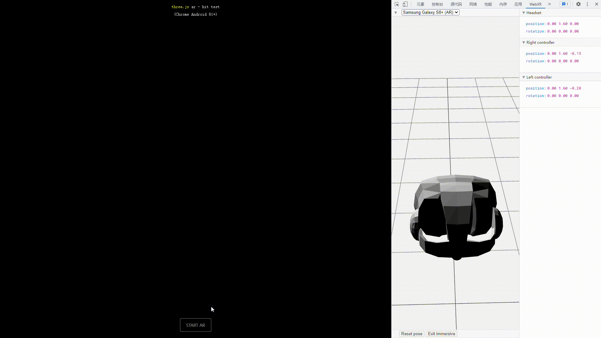

# TODO

- 学习如何使用各个 WebXR-AR API：2021.08.03 ， immersive-web 主席的演讲，她代码演示了如何使用各个 API ！ https://www.youtube.com/watch?v=t-uk8InHte4&list=PLW2iP2Rz9wsKTPwDEW1KhxcWkuwur_E9t （点进下面兼容性表的「Explainer」，里面好像有教程代码！）
- Babylon.js 官网中有 WebXR API 的示例代码，可惜是基于 Babylon.js 的：https://doc.babylonjs.com/divingDeeper/webXR/introToWebXR


# WebXR emulator

WebXR emulator 是由 mozilla 开发的浏览器插件，用于在浏览器中模拟 AR/VR 设备，安装与介绍请见 [官方 Blog](https://blog.mozvr.com/webxr-emulator-extension/)。

## 如何模拟 VR

1. 在控制台中选择 WebXR 扩展；
2. 选择正确的 VR 设备；
3. 打开 VR 页面（请确保在开启 VR 页面之前，已经选择了正确的 VR 设备）；
4. 使用；


## 如何模拟 AR

1. 在控制台中选择 WebXR 扩展；
2. 选择正确的 AR 设备（目前只有 Samsung Galaxy S8+(AR) 可用）；
3. 打开 AR 页面（请确保在开启 AR 页面之前，已经选择了正确的 AR 设备）；
4. 使用；

用 WebXR emulator 来模拟使用 AR 并不怎么好用。




# WebXR API

##  API 实现进度

- API 将在何时完成：https://www.w3.org/2020/05/immersive-Web-wg-charter.html
- 现在支持哪些 API ：https://immersiveweb.dev/

## API 介绍

截至 2021 年 8 月 3 日，浏览器支持的 API 如下：

1. WebXR Core
2. AR Module
3. Gamepads
4. Hit Test
5. DOM Overlays
6. Layers
7. Hand Input
8. Light Estimation

> 参考资料：
>
> - [Ada Rose Cannon 介绍了各个 API 的定义的用法（2021.08.03）](https://www.youtube.com/watch?v=t-uk8InHte4&list=PLW2iP2Rz9wsKTPwDEW1KhxcWkuwur_E9t)
> - [Ada Rose Cannon 介绍了 WebXR 在未来将会新增那些特性（2020.09.04）](https://www.youtube.com/watch?v=ypSkIYpJjE8)
> - [WebXR 官网的底部描述了当前所有特性的实现状况](https://immersiveweb.dev/)
> - [视频展示每种 API （2020.10.21）](https://www.youtube.com/watch?v=dssQSeTrqPI)

### WebXR Core

WebXR Core 是第一个 WebXR 模块，它被设计成其它模块的底层。

通过挂载在 `window.navigator` 上的 `xr` 对象来使用 WebXR Core ：

```js
if ("xr" in window.navigator) {    
	/* WebXR can be used. */

    const supported = await window.navigator.xr.isSessionSupported("immersive-vr");
    const xr_session = await window.navigator.xr.requestSession("immersive-vr");
    
} else {
    /* WebXR isn't available. */
}
```

> WebXR Core 自身仅支持虚拟现实（ VR ），增强现实由后来退出的增强现实模块支持。

### AR Module

增强现实模块非常简单，它能让 WebXR 场景渲染虚拟的内容，比如使用 WebXR 在智能手机或透明显示器上显示虚拟的内容。它没有任何增强现实的高级特性，高级特性们都来自额外的 WebXR 模块。

增强现实的使用方法和虚拟现实的使用方法非常相似：

```js
if ("xr" in window.navigator) {
	/* WebXR can be used. */
    
    const supported = await window.navigator.xr.isSessionSupported("immersive-ar");
    const xe_session = await window.navigator.xr.requestSession("immersive-ar");
    
} else {
    /* WebXR isn't available. */
}
```

### DOM Overlays

由于 WebXR 是基于 WebGL 的，没有对 HTML 和 CSS 的内置支持，这意味着如果你想要构建用户界面或添加超链接标签，都只能通过 WebGL 来构建，事情就会变得非常棘手，比如将需要渲染的内容输出为图像，然后将图像作为纹理贴在虚拟物体的表面。

DOM Overlays 允许你在场景中使用部分的 HTML 和 CSS ，注意该特性目前只适用于手持设备的增强现实（ Ada Rose Cannon ：因为只有在该场景下才有意义）。

它的工作原理是：激活 session 之前，你需要调用 DOM Overlays 特性，并传递一个元素节点进来，之后增强现实程序将会拥有 3 个视图层。顶层是 HTML/CSS 视图层，它由用户代理渲染，且该元素节点会被全屏展示；中间层是 WebGL 视图层（由 WebGL 渲染并发送至 WebXR ），底层是摄像机视图层。

除了能够更轻松的绘制用户界面外，它的另一个好处是：相比于在 WebGL 中渲染用户界面， HTML/CSS 的渲染速度更快、延迟更低，因为将内容制成位图再输出为纹理时更慢，且有时还要考虑光照的影响。

```js
window.navigator.xr.requestSession("immersive-ar", {
    optionalFeatures: ["dom-overlay"],
    domOverlay: {
        root: document.getElementById("overlay")
    }
});
```

> `optionalFeatures` 是指该特性是可选的，当运行时不支持该特性时，程序也不会被杀死，而是忽略使用该特性。

### Gamepads

它是针对虚拟现实和增强现实的特性，用于支持游戏手柄。你可以通过 WebXR 的输入源来访问相应的游戏手柄对象， WebXR 输入源可以是各种各样的用于访问场景的控制器设备，比如单手持握的遥控器，上面有摇杆，还有各种按钮，还可以检测物体的位置和旋转，所有按钮和摇杆都会被当作 gamepad 对象，你可以获取按钮的压力和摇杆的运动。

该 API 和现有的 gamepad API 几乎一样：

```js
for (const source of session.inputSources) {
    
    if (source.gamepad) {
        
        /* use gamepad information. */
        
    }
    
}
```

> 我不会用。

### Hand Input

它借助摄像头来捕捉你的双手，确定双手的位置，从而实现对场景的操作。有些设备同时结合了 Hand Input 和 Gamepads ，并根据用户的行为在两者之间切换。

先要判断输入源是否是人手（而不是 gamepad ） ，然后就像使用 gamepad 一样，先获取输入源，再使用输入源下的 hand 对象，该对象包含了所有关于手的信息，比如手部每一处关节的信息，因此你可以借此来渲染手模型，或者用来与场景互动，比如抓握东西、戳东西、指方向。

```js
for (const source of session.inputSources) {
    
    if (source.hand) {
        
        /* use hand information. */
        
    }
    
}
```

### Hit Test

别称 raycasting （光线投射检测）。

它是针对增强现实的，它能让你的增强现实场景将光线投射到现实世界的平面上，然后向你提供命中处的空间信息。

它的使用方法比较复杂，介绍之前需要先澄清关于「空间」的概念： WebXR 所检测到的每个硬件都有与之相关联的对象（称为「空间对象」），例如输入源有 `targetRaySpace` 和 `gripSpace` ， `gripSpace` 包含了用户的抓握信息， `targetRaySpace` 包含从控制器前端发出的射线信息。

下述例子中，我们将演示如何从控制器的前端发射一束射线来进行光线投射检测。

1. 首先我们需要实例化 API ，因为它无法在 session 运行期间被实例化，因此必须在画面载入前实例化它；
2. 然后在帧循环中，从光线投射检测的输入源中获取 `hitTestResults` ；
3. 要想获取命中处的空间信息，需要向其输入场景的参考空间， `getPose` 方法才能计算出命中处在你的场景中的位置（ `position` ）、方向（ `orientation` ）、变换矩阵（ `matrix` ）；

```js
/*
 * 实例化光线投射检测API。
 */
const hit_test = session.requestHitTestSource({
    space: inputSource.targetRaySpace
});

/*
 * 在帧循环中获取检测结果（下述代码需要放在帧循环中执行）。
 */
const hit_test_results = frame.getHitTestResults(this.xrHitTestSource);

if (hit_test_results.length > 0) {
    
    const pose = hit_test_results[0].getPose(scene_reference_space); // 命中处的空间信息。
    
}
```

### Layers


### Lighting Estimation

照明估计。

通过计算机视觉来粗略估计真实环境中的光照情况，诸如光的方向、颜色，然后在三维场景中模拟出真实世界的光照，虚拟物体接收并反射近似真实世界的光照，将会让它们更加逼真。


### Anchors

锚点。

它是一个微妙却又强大的特性。增强现实的底层在运行期间会不断的扫描环境以更好的了解坐标系中的物体们彼此之间的位置关系，有时底层会更新某些东西，如果你将物体放在距离原点较远的地方，当场景发生稍微发生变化后，这些物体的位置就有可能会漂移。

锚点的工作方式是：当场景更新时，锚点也会相应的移动，最后锚点会看起来始终留在原位，因此你相对于锚点放置的任务物体就可以一直保持原位。

这个特性可以极大的增强真实感。

### Layers

层。

我不明白这个 API 的用户，它好像是可以将视频/图像渲染任务交给用户代理来干，然后用户代理再把结果交给三维场景内的某个虚拟平面，这样子比给虚拟物体贴视频纹理要延迟低的多（因为你需要抽出视频帧，绘制到纹理上，再粘贴到几何体上，再在每一帧更新纹理，再重新应用）。而且听说，用 Layers 做出的视频/图像画面延迟更低更高清，对于创建影院或与视频相关的 AR 程序会很有帮助。

这样子看来， Layers 也可以作为 DOM Overlay 的 Polyfill 来用。


# 其它资料

- WebXR 主页：https://immersiveweb.dev/
- WebXR Github：https://github.com/immersive-web